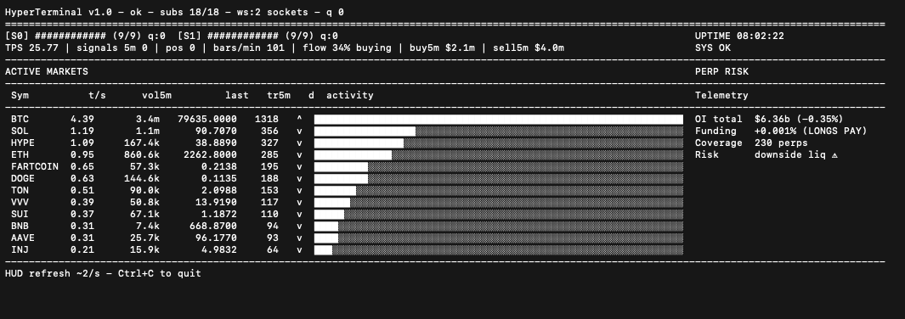

# HyperTerminal

A small terminal-native Hyperliquid market monitor.

This connects to Hyperliquid's public market feed, subscribes across active markets, tracks rolling flow/volume, and renders a live dashboard in the terminal.

It started as a public-facing offcut from a larger Hyperliquid trading system. This repo keeps the market-data and terminal UI layer only.

## Screenshot



## Features

- Live Hyperliquid public market feed
- Multi-market WebSocket subscriptions
- Rolling 5-minute buy/sell flow
- Active markets table
- Perp open-interest / funding summary
- Terminal-native dashboard
- Runtime JSON snapshot for other scripts

## Setup

```bash
git clone https://github.com/tropicaengineering/hyperterminal.git
cd hl-terminal


python3 -m venv .venv
source .venv/bin/activate

pip install -r requirements.txt